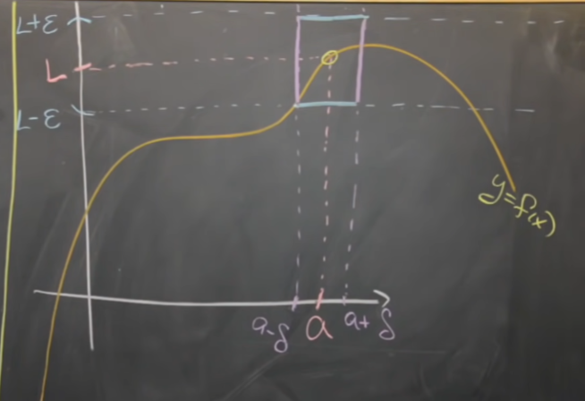

See also
	[[Proof of a limit by definition]]

Given some function 
$$
	f : \Re \rightarrow \Re
$$
we say,
$$
	\lim
		_{x \rightarrow a}
		{ f(x) }
	= 1
$$
if,   $\forall \epsilon > 0$,   $\exists \delta > 0$  such that,
$$
\begin{matrix}
	&
		0
	&<&
		\left| 
			x - a
		\right|	
	&<&
		\delta 
		\\
	\Rightarrow
	&	
		0
	&<&
		\left|
			f(x) - L
		\right|
	&<& 
		\epsilon
\end{matrix}
$$

*Intuitively,*

*It's not what happens at the point of the limit itself, but rather what happens around it.*

Essentially, as long as the inequality holds, when $\begin{cases}{\delta \rightarrow 0}\\ {\epsilon \rightarrow 0}\end{cases}$  the limit of the point at A will be L.

---

	

---
