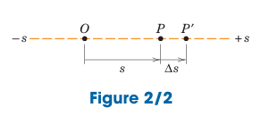

---
tags:
  - displacement
series: classical mechanics
branches: kinematics
---
consider a particle $P$ moving along a straight line, Fig. 2/2.

	

The position of P at any instant of time $t$ can be specified by its distance $s$ measured from some convenient reference point $O$ fixed on the line. 

At time $t + \Delta t$ the particle has moved to $P'$ and its coordinate becomes $s + \Delta$.
The change in the position coordinate during the interval $\Delta t$ is called the *displacement* $\Delta s$ of the particle. 

