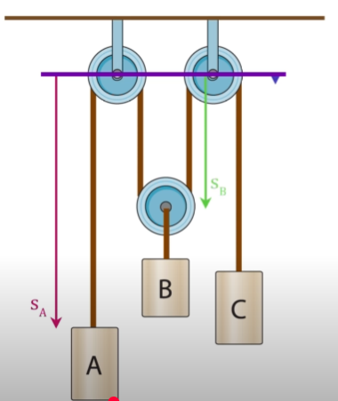

	

the purple line represents the _datum_, which is defined as the reference line where its position is fixed with respect to other parts of the system that moves. 

the top pulleys are fixed to the roof, so they do not move.